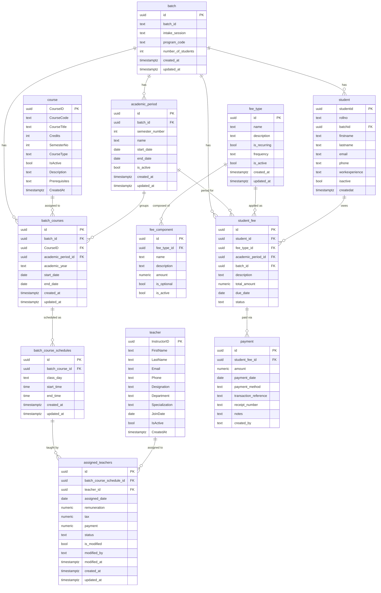

# University Database Management System

A Next.js + Supabase application for managing university batches, students, teachers, courses, schedules, and fees.

---

## Database Schema (ERD)

---

## Table Overview

| Table | Description |
|-------|-------------|
| `batch` | Program cohorts (e.g. BCS-2023-A) |
| `student` | Students enrolled in batches |
| `teacher` | Instructors/faculty |
| `course` | Course catalogue |
| `academic_period` | Semesters per batch |
| `batch_courses` | Courses assigned to a batch in a semester |
| `batch_course_schedules` | Weekly class schedule for a batch course |
| `assigned_teachers` | Teacher assigned to a schedule slot, with remuneration |
| `fee_type` | Fee categories (e.g. Semester Fee, Registration Fee) |
| `fee_component` | Line items that make up a fee type |
| `student_fee` | Fee assigned to a specific student |
| `payment` | Payment transactions against a student fee |

---

## Tech Stack

- **Framework:** Next.js 15 (App Router)
- **Database & Auth:** Supabase (PostgreSQL)
- **UI:** shadcn/ui + Tailwind CSS
